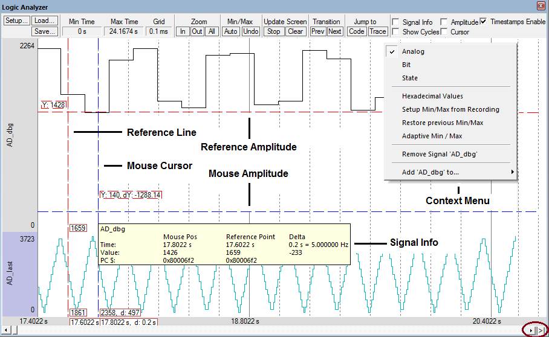

================================
Ejemplos de uso de CMSIS RTOS V2
================================

El repositorio contiene los ejemplos básicos para entender el funcionamiento de la API CMSIS-RTOS V2 utilizando el sistema operativo RTX version 5.
Los ejemplos están implementados para utilizar mínimamente los periféricos del microcontrolador y hacer hincapié en los conceptos de manejo del Sistema Operativo.

Los ejemplos se han implementado para el STM32F429 utilizado en la asignatura **Sistemas Basados en Microprocesador** de la **(ETSI Sistemas de Telecomunicación) Universidad Politécnica de Madrid** y se pueden ejecutar utilizando el simulador del microprocesador incluido en el entorno de ARM keil Microvision o bien el hardware.

*******************
Descarga del código
*******************

Para descargar el código puede utilizar un cliente de git en su ordenador o bien descargar el repositorio completo (formato **zip**). Las instrucciones para clonar el repositorio son:

.. note:: Descarga del código

    .. code-block:: shell 
    
      $ git clone https://github.com/mruizglz/SBM-rtos.git

*****************************
Listado de ejemplos incluidos
*****************************

.. list-table:: Ejemplos incluidos
   :header-rows: 1

   * - Carpeta
     - Objetivos
   * - **ejemplothreads**
     - Aprender el manejo básico de creación de threads. Uso de la misma función con parámetros parea crear multiples threads
   * - **ejemplothreads-flags**
     - Sincronización de threads usando flags
   * - **ejemplothreads-queues**
     - Intercambio de datos entre threads usando colas
   * - **ejemplothreads-timers**
     - Gestion de timers "software"

**********************************
Configuración del Proyecto de Keil
**********************************

-----------------
Uso del simulador
-----------------

ARM Keil Microvision dispone de opciones para configurar donde se ejecutará la aplicación (Icono *Options for Target*). Seleccione **Debug** y active el uso del simulador (**Use Simulator**). 
Es necesario que configure el fichero de inicialización (**Initialization File**) para que cargue un script de configuración del microcontrolador. En este caso, seleccione el fichero ``simulator.ini`` que se encuentra en cada una de las carpetas de ejmplo. Por ejemplo en la carpeta ``.\ejemplothreads`` del repositorio encontrará el fichero **simulador.ini** con este contenido:

.. literalinclude:: ../ejemplothreads/simulator.ini
  :language: ini
  :linenos:
  

El significado de estas instrucciones es habilitar para el simulador las operaciones de lectura/escritura en las zonas de memoria donde se encuentran los periféricos.

.. tip:: 

   Cuando se usa el simulador de Keil las operaciones de escritura y lectura de los periféricos no tienen ningún efecto y por tanto no podrá simular el comportamiento hardware de los mismos
   Todas las operaciones de la capa HAL que actúan sobre periféricos no tendrán ningún efecto. Por ejemplo, si en el código se configura un pin como salida y luego se escribe un valor alto en el mismo, no podrá ver ningún cambio en el estado del pin.

Como podrá ver en el código del programa ``main.c`` existe compilación condicional para incluir o no el código de configuración del RCC para usar un reloj externo (HSE). 
Si utiliza el simulador debe desactivar esta opción y usar el reloj interno (HSI) que es el que utiliza el simulador. La pestaña **C/C++(AC6)** permite añadir en ``define`` etiquetas. Incluya ``SIMULATOR`` si quiere utilizar el simulator.

----------------
Uso del hardware
----------------

Si dispone de una placa con el microcontrolador STM32F429 puede ejecutar el código directamente en el hardware. En este caso debe configurar las opciones del proyecto para que utilice el ST-Link en lugar del simulador. 

**No defina la variable** ``SIMULATOR`` en las opciones de compilación para que el circuito de RCC se configure adecuadamente. 

-----------------------------------------------
Depuración de aplicaciones usando CMSIS-RTOS V2
-----------------------------------------------

La depuración de las aplicaciones se debe realizar combinando el uso de puntos de ruptura y de la aplicación RTX RTOS view disponible en el menu ``View->Watch Windows->RTX RTOS``. 
Esta permite ver el estado en el que se encuentran los diferentes objetos del sistema operativo cuando el procesador pausa su ejecución. Herramientas complementarias para entender
el funcionamiento de una aplicación son ``Logyc Analyzer``, ``Performance Analyzer``, ``System Analyzer``, ``Event Recorder``. ``Event Statistics`` y ``Symbols Window``

^^^^^^^^^^^^^^
Symbols Window
^^^^^^^^^^^^^^

La opción **Symbols Window** permite visualizar y explorar todos los símbolos definidos en el proyecto, incluyendo variables globales, variables estáticas, funciones y direcciones de registros . Esta ventana es útil para depuración y análisis en tiempo real.

- Muestra una lista jerárquica de todos los símbolos disponibles en el programa cargado.
- Permite buscar y filtrar símbolos por nombre.
- Muestra la dirección y el valor actual de cada símbolo durante la sesión de depuración.
- Facilita el arrastre de variables a otras ventanas de análisis, como el Watch Window o el Logic Analyzer.
- Permite examinar variables optimizadas si están disponibles en la tabla de símbolos.
- Si un símbolo no aparece, verifique la configuración de optimización del compilador y el ámbito de la variable.

Para utilizarlo:

1. Iniciar una sesión de depuración.
2. Abrir la ventana desde el menú: :menuselection:`View --> Symbol Window`.
3. Buscar el símbolo deseado utilizando el campo de filtro.
4. Arrastrar el símbolo a la ventana de Watch o ``Logic Analyzer`` para su monitorización.

^^^^^^^^^^^^^^
Logic Analyzer
^^^^^^^^^^^^^^

Permite visualizar la evolución temporal de variables que sean globales a la aplicación, el contenido de posiciones de memoria, etc. Se puede configurar el rango de valores y es muy apropiado para comparar visualmente la evolución de la aplicacón software a través del seguimiento de variables.
Para agregar señales al ``Logic Analyzer`` puede arrastrarlas de la ventana de símbolos o escribir el nombre de la misma.

   Figura 1. Analizador lógico de ARM Keil Microvision.
